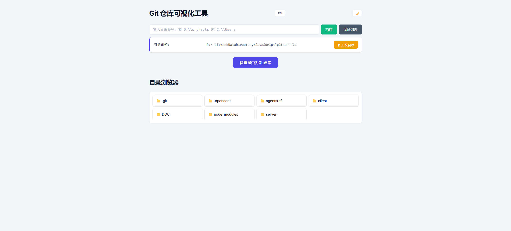
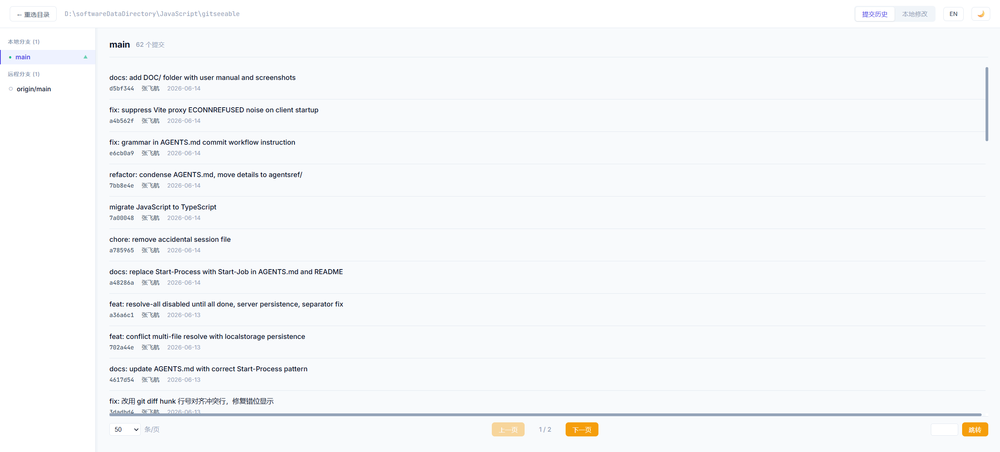
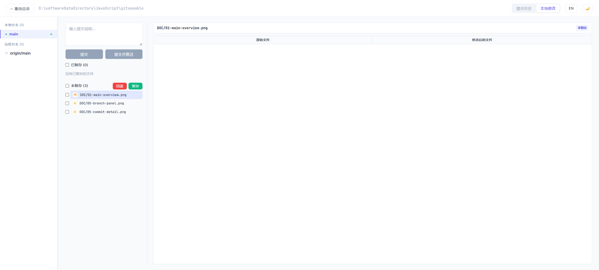
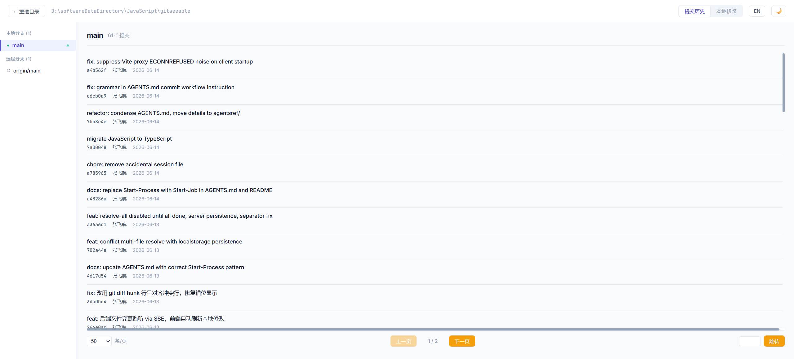

# GitSeeable 用户操作手册

## 目录

1. [首页：选择仓库](#1-首页选择仓库)
2. [主界面布局](#2-主界面布局)
3. [提交历史](#3-提交历史)
4. [分支管理](#4-分支管理)
5. [本地修改](#5-本地修改)
6. [深色模式](#6-深色模式)
7. [中英文切换](#7-中英文切换)

---

## 1. 首页：选择仓库

打开应用后，首先看到的是仓库选择页面。这里提供了三种方式进入一个 Git 仓库。

### 通过最近访问路径进入

如果之前访问过某个仓库，页面会显示 **最近访问路径** 列表。每个路径右侧有一个 **分析仓库** 按钮，点击即可直接进入。

### 手动输入路径

在页面顶部的输入框中，可以手动粘贴或输入 Git 仓库的完整路径（例如 `D:\projects\my-repo`），然后点击 **确认** 按钮。应用会自动检测该目录是否为 Git 仓库。

### 浏览本地目录

点击 **浏览本地目录** 按钮，页面会列出当前系统的驱动器（如 C:、D:）。逐级展开目录，找到包含 `.git` 文件夹的目标仓库后，页面会出现 **这是一个 Git 仓库，分析它** 的按钮，点击即可进入分析界面。

### 多标签页支持

每个浏览器标签页可以独立选择不同的仓库目录。选择的目录路径会记录在 URL 中（例如 `?dir=D%3A%5Cprojects%5Cmy-repo`），因此刷新页面或在新标签页中打开同一个链接，都会恢复到对应的仓库。不同标签页之间互不影响。

---

## 2. 主界面布局

进入仓库分析页面后，整个界面分为几个区域：

### 顶部导航栏

- **仓库路径**（左上角）：显示当前正在分析的仓库完整路径
- **标签页切换**：**提交历史** 和 **本地修改** 两个标签页
- **刷新按钮**：🔄 手动重新加载当前数据
- **语言切换**：中 / EN，点击切换界面语言
- **主题切换**：🌙 / ☀️，点击切换深色/浅色模式

### 左侧面板：分支列表

左侧显示一个可拖拽调整宽度的面板，包含：

- **本地分支**：当前仓库的所有本地分支
- **远程分支**：远程仓库的分支（如 origin/main）

当前所在的分支会高亮显示并带有标记。面板右侧有一个拖拽手柄，可以左右拖动调整面板宽度。

### 右侧主内容区

根据当前选中的标签页，显示不同的内容。

---

## 3. 提交历史

提交历史标签页按时间倒序显示仓库的所有提交记录。

### 提交列表

每条提交记录显示：

- **分支图谱**：左侧以 ASCII 线条和色块展示分支拓扑结构。每个提交在图上有一个对应位置，不同分支使用不同颜色（共 8 种颜色）区分。线条表示分支的分叉与合并关系。
- **提交信息**：提交的说明文字（commit message）
- **提交哈希**：简短的提交 ID（如 `d5bf344`）
- **作者**：提交者的名称
- **日期**：提交的日期（如 `2026-06-14`）

### 查看文件变更

点击任意提交记录，该行会展开，显示此次提交中所有变更的文件列表。文件列表包含：

- 文件名和路径
- 文件变更类型（新增、修改、删除）

### 查看文件差异

在展开的文件列表中点击任意文件，主内容区会显示该文件的详细差异对比（diff）：

- **逐行对比**：左侧显示原文件，右侧显示修改后的文件
- **增减标记**：绿色背景表示新增的行，红色背景表示删除的行
- **行号显示**：每行前显示对应的行号
- **对比模式**：支持上下对比和左右分栏对比

### 分页控制

页面底部提供分页功能：

- **每页数量**：下拉选择每页显示的提交数（10 / 20 / 50 / 100 / 200 条）
- **翻页按钮**：上一页 / 下一页
- **页码跳转**：输入页码数字，点击 **跳转** 按钮直接跳转到指定页
- **当前页信息**：显示当前页码和总页数（如 `1 / 2`）

### 未推送提交标记

当选中某个分支查看提交历史时，尚未推送到远程仓库的提交记录右侧会显示一个蓝色的 **↑** 箭头标记，方便区分哪些提交已经推送、哪些还在本地等待推送。该标记只在筛选单个分支时显示，查看全部分支时不会出现。

### 提交右键菜单

在提交列表中，右键点击任意一条提交记录，会弹出上下文菜单，提供以下操作：

| 操作 | 说明 |
|------|------|
| **优选此提交** | 将此次提交的变更应用到当前分支（`git cherry-pick`）。如果当前选中的提交是 HEAD 顶端，则此选项不可用。 |
| **还原此提交** | 创建一个新提交来撤销此次提交的变更（`git revert`）。 |
| **重置到此 commit** | 将当前分支的 HEAD 重置到此提交（`git reset --hard`）。**注意：此操作会丢弃该提交之后的所有变更。** |
| **删除此提交** | 从历史中删除此提交（`git rebase --onto` + `git branch -D`），仅对当前分支的 HEAD 提交可用。 |

操作成功后，提交历史会自动刷新。如果产生冲突（如 cherry-pick 或 revert），会显示错误信息。

重置操作会弹出确认对话框（支持"之后不再询问"选项），确认后执行 `git reset --hard`。

### 分支筛选

双击左侧面板中的某个分支名称，提交历史将自动筛选，只显示该分支的提交记录。此时顶部导航栏会出现该分支的标签，点击标签上的 × 即可恢复显示全部分支。

---

## 4. 分支管理

### 查看分支列表

左侧面板列出所有本地分支和远程分支。当前所在的分支会有选中高亮样式和一个箭头标记。

### 分支上下文菜单

在任意分支上右键点击，会弹出一个上下文菜单，提供以下操作：

| 操作 | 说明 |
|------|------|
| **切换** | 切换到选中的分支。如果该分支是远程分支（如 origin/feature），会自动创建本地跟踪分支。如果当前工作区有未提交的更改且与目标分支冲突，会提示冲突信息。 |
| **创建分支** | 基于当前分支创建一个新分支。需要输入新分支的名称。 |
| **合并** | 将选中的分支合并到当前所在分支。如果产生冲突，会进入冲突解决流程。 |
| **变基** | 将当前分支变基到选中的分支上。如果产生冲突，同样会进入冲突解决流程。 |
| **重命名** | 修改选中的本地分支的名称。 |
| **删除** | 删除选中的本地分支。无法删除当前所在的分支。如果分支未完全合并，会弹出确认对话框，确认后强制删除（`git branch -D`）。 |
| **推送** | 将选中的分支推送到远程仓库。 |
| **拉取** | 从远程仓库拉取最新数据到选中的分支。如果本地有未提交的变更且与拉取的变更冲突，会弹出冲突文件列表对话框，确认后可继续拉取。 |

### 远程分支管理

远程分支（如 origin/main）支持以下操作：

- **切换**：自动创建对应的本地跟踪分支
- **拉取**：从远程更新

远程分支不能被重命名或删除（这些操作需要在远程仓库上执行）。

### 分支比较

点击分支列表顶部的 **比较** 按钮（如果有），可以比较两个分支的差异，显示 ahead（领先）和 behind（落后）的提交数量。

---

## 5. 本地修改

点击 **本地修改** 标签页，进入工作区变更管理界面。

### 变更文件列表

页面列出当前工作区的所有变更文件，按状态分为几类：

- **已暂存**（Staged）：已通过 `git add` 添加到暂存区的文件
- **已修改**（Modified）：已修改但尚未暂存的文件
- **未跟踪**（Untracked）：新增的尚未被 Git 跟踪的文件

每个文件项显示文件名和变更状态图标。

### 文件操作

每个文件项右侧有三个操作按钮：

| 按钮 | 说明 |
|------|------|
| **暂存**（+） | 将文件添加到暂存区，准备提交 |
| **取消暂存**（-） | 将文件从暂存区移出 |
| **还原**（↩） | 撤销文件的修改，恢复到最近一次提交的状态 |

对于未跟踪的文件，只能执行暂存操作（不能还原，因为还没有历史版本）。

### 查看文件差异

点击文件列表中的任意文件，右侧会显示该文件的差异对比视图：

- **原文件 vs 修改后文件**：左右分栏对比
- **逐行高亮**：绿色表示新增行，红色表示删除行
- **可拖拽分隔线**：左右两栏之间的分隔线可以左右拖动，调整两栏的宽度比例
- **大文件支持**：采用虚拟滚动技术，即使是非常大的文件也能流畅展示差异

### 提交变更

在页面底部的提交区域：

1. 确认需要提交的文件已经暂存（Staged）
2. 在输入框中填写提交信息（commit message）
3. 点击 **提交** 按钮

提交成功后，变更列表会清空，左侧提交历史会自动更新。

### 冲突解决

当合并或变基操作产生冲突时，会自动进入冲突解决视图：

- **冲突文件列表**：列出所有存在冲突的文件
- **逐文件解决**：点击文件查看冲突详情
- **代码块对比**：显示每个冲突区域的几种版本：
  - 当前分支版本（ ours ）
  - 合并目标版本（ theirs ）
  - 合并后的版本（可以手动编辑）
- **分支选择**：点击 diff 顶部的分支名（当前分支 / 目标分支），可以一键选中该侧所有的冲突行，方便快速接受某一方的所有更改
- **接受选择**：可以选择接受当前分支版本、目标版本，或手动编辑后标记为已解决
- **批量解决**：支持逐个文件解决，或一键解决所有已编辑完成的文件

所有冲突解决后，应用会自动执行 `git merge --continue` 或 `git rebase --continue` 完成合并/变基操作。

---

## 6. 深色模式

点击页面右上角的 **主题切换按钮**（☀️ 或 🌙），可以在浅色模式和深色模式之间切换。

- **浅色模式**（☀️）：白色背景，适合白天或光线充足的环境
- **深色模式**（🌙）：深色背景，适合夜间或光线较暗的环境

主题偏好会自动保存，下次打开应用时自动恢复。

---

## 7. 中英文切换

点击页面右上角的 **语言切换按钮**：

- 当前为中文界面时，按钮显示 **EN**，点击后切换到英文
- 当前为英文界面时，按钮显示 **中**，点击后切换到中文

界面中的所有文字（包括按钮、标签、提示信息）会即时切换为对应的语言。语言偏好会自动保存，下次打开应用时自动恢复。
