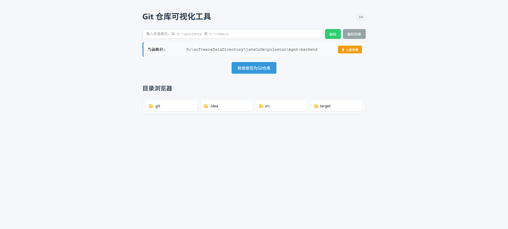
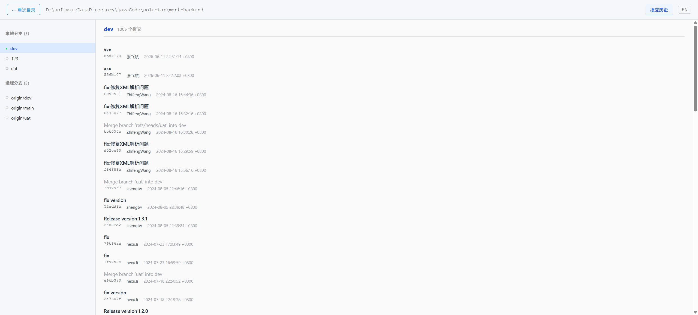

# GitSeeable

[](https://www.npmjs.com/package/gitseeable)
[](https://www.npmjs.com/package/gitseeable)

[中文版](README.zh.md)

A full-stack Git repository visualization tool built with React 19 + Vite 5 (frontend) and Express 5 (backend). Browse local directories, select Git repositories, and manage branches through an intuitive web UI.

## Features

- **Directory Browser** — Navigate local filesystem directories and select Git repositories
- **Branch Management** — View local and remote branches, checkout, create, merge, rename, delete, push, fetch, and rebase
- **Commit History** — Paginated commit log with author, date, and message display
- **Branch Comparison** — Compare two branches to see ahead/behind commits
- **Commit Diff** — View the full diff of any commit
- **Internationalization** — Supports Chinese (default) and English
- **Session Persistence** — Remembers the last browsed directory across sessions

## Screenshots

| Directory Selection | Repository Analysis |
|---|---|
|  |  |

## Requirements

- **Node.js v20.19.3** (other v20 versions may work, but v20.19.3 is tested)

## Tech Stack

| Layer | Technology |
|---|---|
| **Frontend** | React 19, Vite 5, Axios, i18next, SweetAlert2, TypeScript |
| **Backend** | Express 5, simple-git, TypeScript |
| **Module System** | Frontend ESM, Backend CommonJS |

## Getting Started

### Quick Install (npm global)

```bash
npm install -g gitseeable
gitseeable
```

Open http://localhost:3001 in your browser.

### From Source

```bash
# 1. Clone the repository
git clone https://github.com/fei-hang/gitseeable.git
cd gitseeable

# 2. Ensure you're using Node v20.19.3 (e.g. with nvm)
nvm use 20.19.3

# 3. Install dependencies (3 independent installs — no npm workspaces)
npm install
cd client && npm install
cd ../server && npm install

# 4. Production build (bundle frontend + backend)
cd ..
npm run build

# 5. Start server
npm start
# or
node server/dist/index.js
```

Open http://localhost:3001 in your browser.

### Development

```bash
# Install dependencies first (see "From Source" above), then:
npm run dev
```

Open http://localhost:3000 in your browser.

## Commands

| Command | Description |
|---|---|
| `npm run dev` | Start both server + client concurrently |
| `npm run server` | Start backend only (port 3001) |
| `npm run client` | Start frontend only (port 3000) |
| `cd client && npm run build` | Client production build |
| `cd client && npm run lint` | Run ESLint |
| `cd server && npm run dev` | Server dev mode (tsx watch) |
| `cd server && npm run build` | Compile server TypeScript |

## AI-Friendly Quick Start

You can share the following prompts with an AI coding assistant (Cursor, Claude Code, etc.) to start this project automatically.

**Option 1: Quick install via npm (recommended)**

> Install gitseeable globally and run it: `npm install -g gitseeable && gitseeable`. Open http://localhost:3001 in the browser and verify the backend with `Invoke-WebRequest http://localhost:3001/api/drives -Method GET`.

**Option 2: Clone from source**

> Clone https://github.com/fei-hang/gitseeable.git, then run `nvm use 20.19.3` to set the correct Node version, and install dependencies with `npm install && cd client && npm install && cd ../server && npm install`. Start development with `npx tsx server/index.ts &` and `npx vite &` (Linux/macOS) or `Start-Job -ScriptBlock { npx tsx server/index.ts }` and `Start-Job -ScriptBlock { Set-Location "client"; npx.cmd vite }` (PowerShell). Background the processes so your terminal stays available. Verify the backend with `Invoke-WebRequest http://localhost:3001/api/drives -Method GET` and open http://localhost:3000 in the browser.

## License

ISC
